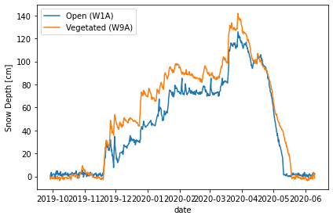

# Gallery

This is a gallery of examples that you can use to get started with `snowexsql`.

::::{grid}
:gutter: 3

:::{grid-item-card} What is in the database?
:link: what_is_in_the_db_example.html  
:::

:::{grid-item-card} Overview
:link: overview_example.html
:::

:::{grid-item-card} Getting Started
:link: getting_started_example.html
:::
::::

::::{grid}
:gutter: 3

:::{grid-item-card} Raster Union and More
:link: raster_union_and_more_example.html

:::

:::{grid-item-card} Plot Raster
:link: plot_raster_example.html

:::

:::{grid-item-card} Plot Pit SWE
:link: plot_pit_swe_example.html

:::
::::

::::{grid}
:gutter: 3

:::{grid-item-card} Graupel SMP
:link: graupel_smp_example.html

:::

:::{grid-item-card} Graupel Pits
:link: graupel_pits_example.html

:::

:::{grid-item-card} Get Spiral
:link: get_spiral_example.html

:::
::::

::::{grid}
:gutter: 3

:::{grid-item-card} Compare UAVSAR to Depths
:link: compare_UAVSAR_to_depths_example.html

:::

:::{grid-item-card} Compare SSA Instruments
:link: compare_SSA_instruments_example.html

:::

:::{grid-item-card} Camera Derive Snow Depths
:link: camera_derive_snow_depths_example.html

:::
::::

::::{grid}
:gutter: 3

:::{grid-item-card} API Intro Example
:link: api_intro_example.html
:::

:::{grid-item-card} API Plot Pit Density 
:link: api_plot_pit_density_example.html
:::

::::
